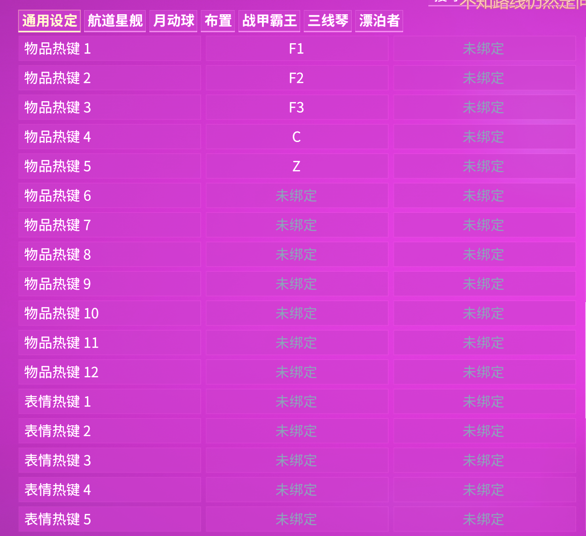

---
metaLinks:
  alternates:
    - https://app.gitbook.com/s/sc7MPTyiIfSwOeLlvpUg/basics/gearwheel-equipment
---

# 物品快捷栏

<strong>曲翼发射器</strong>

* 需要[**曲翼发射器**](https://warframe.huijiwiki.com/wiki/%E6%9B%B2%E7%BF%BC%E5%8F%91%E5%B0%84%E5%99%A8)
* [**刺影**](https://warframe.huijiwiki.com/wiki/Itzal)是最推荐的（来自氏族道场）
  * 星体震荡（3）：吸取小夜灵和战利品

<strong>破解器</strong>

* [**100x 破解器 蓝图**](https://warframe.huijiwiki.com/wiki/%E7%A0%B4%E8%A7%A3%E5%99%A8) 从氏族道场复制
  * _36000 铁氧体 & 36000 纳米孢子_
* 允许快速破解，在破解界面按 Y

<strong>团队能量补给（井盖）</strong>

* [**100x 团队能量补给（大型）蓝图**](https://warframe.huijiwiki.com/wiki/%E5%9B%A2%E9%98%9F%E8%83%BD%E9%87%8F%E8%A1%A5%E7%BB%99) 从氏族道场复制
  * _5000 聚合物束 & 30000 纳米孢子_
* 在 30 秒内，每隔 7.5 秒恢复 100 能量。
* 适用于紧急情况。

<strong>空中支援呼叫器：治愈之塔</strong>

* [**100x 空中支援呼叫器 蓝图**](https://wiki.warframe.com/w/Air_Support_Charges) 从氏族道场复制
  * _12000 铁氧体, 20000 回收金属, 10 非晶态合金 & 7000 生物质_
* 它有碰撞体积，所以你**可以用它直接引爆 7 支架**
* 用于维持 Nova 的生命值

<strong>位置-图针</strong>

* [**蓝图**](https://warframe.huijiwiki.com/wiki/%E4%BD%8D%E7%BD%AE-%E5%9B%BE%E9%92%88) 可以从氏族道场复制
* 在开放地图中永久标记一个位置

<strong>待命舰员</strong>

* 在 wiki 上查看更详细的内容: [<mark style="color:$success;">**待命舰员**</mark>](https://warframe.huijiwiki.com/wiki/%E9%AD%85%E5%BD%B1#%E5%BE%85%E5%91%BD%E8%88%B0%E5%91%98)

<strong>曲翼枪械设置器 </strong><mark style="color:$info;"><strong>(可选)</strong></mark>

* 任意武器：可以装备[**主要**](https://warframe.huijiwiki.com/wiki/%E4%B8%BB%E8%A6%81%E7%86%9F%E7%BB%83)和[**次要熟练**](https://warframe.huijiwiki.com/wiki/%E6%AC%A1%E8%A6%81%E7%86%9F%E7%BB%83)，被动的增加近战武器的**连击持续时间**
  * 需要 [**曲翼枪械赋能槽连接器**](https://warframe.huijiwiki.com/wiki/%E6%9B%B2%E7%BF%BC%E6%9E%AA%E6%A2%B0%E8%B5%8B%E8%83%BD%E6%A7%BD%E8%BF%9E%E6%8E%A5%E5%99%A8)
* 仅限 [**辐光弩炮**](https://warframe.huijiwiki.com/wiki/%E8%BE%90%E5%85%89%E5%BC%A9%E7%82%AE)**：** 提高增幅器暴击几率和伤害的 Buff
  * 需要 [**曲翼枪械设置器**](https://warframe.huijiwiki.com/wiki/%E6%9B%B2%E7%BF%BC%E6%9E%AA%E6%A2%B0%E8%AE%BE%E7%BD%AE%E5%99%A8)

<mark style="color:$info;"><strong>殁世机甲(可选)</strong></mark>

* 可以使希图斯的大门保持打开
* 可以用来射击被遮挡的小夜灵

<strong>K式悬浮板 </strong><mark style="color:$info;"><strong>(可选)</strong></mark>

* 可以保持希图斯大门打开
* **可以修复许多 bug**，如果你遇到了一个bug，只需要尝试召唤K式悬浮板，然后看看它是不是好了（大多数时候会好的）
* 使你免疫来自于夜灵的磁力异常（很少用来做这个）
* [**组装的K式悬浮板**](https://warframe.huijiwiki.com/wiki/K%E5%BC%8F%E6%82%AC%E6%B5%AE%E6%9D%BF#%E5%88%B6%E9%80%A0)可以装备[**能量果汁**](https://warframe.huijiwiki.com/wiki/%E8%83%BD%E9%87%8F%E6%9E%9C%E6%B1%81) mod 恢复能量

<strong>远古治愈者 </strong><mark style="color:$info;"><strong>(推荐的可选项)</strong></mark>

* 从新世间集团兑换
* 一个包含抗击到的治愈光环


**不要忘记在军械库 -> 携带物品 里装备这些**

**他们可以在 选项 -> 自定义按键绑定 里绑定快捷键**


