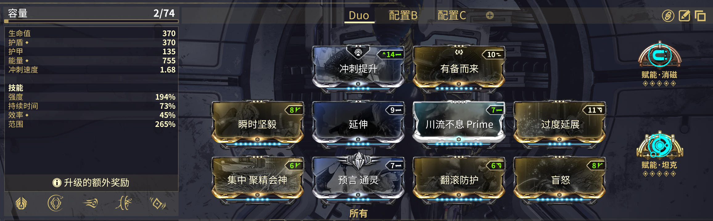
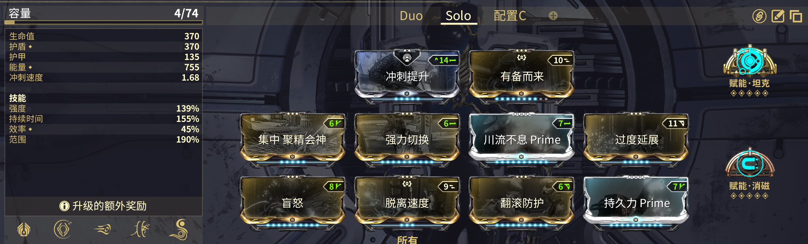

---
metaLinks:
  alternates:
    - https://app.gitbook.com/s/sc7MPTyiIfSwOeLlvpUg/builds/advanced-builds/nova
---

# Nova

## 双人

<figure><figcaption></figcaption></figure>

<figure><figcaption></figcaption></figure>


* [**坦克赋能**](https://warframe.huijiwiki.com/wiki/%E5%9D%A6%E5%85%8B%E8%B5%8B%E8%83%BD)和[**主要堡垒**](https://warframe.huijiwiki.com/wiki/%E4%B8%BB%E8%A6%81%E5%A0%A1%E5%9E%92)进行联动，为天穹之顶增加伤害。
  * 这意味着你**不需要**装备紫晶源力石增加主武器电击伤害。
    * 如果你愿意，你也可以不使用坦克赋能，但需要你装备紫晶源力石增加主武器电击伤害。
  * 坦克赋能持续 1 分钟，但无法刷新，在每个夜灵倒地 30 秒后再召唤空战武器触发。
* **低持续**是可以接受的。
  * [**虫洞**](https://warframe.huijiwiki.com/wiki/%E8%99%AB%E6%B4%9E) 不受持续时间影响， [**战吼**](https://warframe.huijiwiki.com/wiki/%E6%88%98%E5%90%BC) 则只在出水时使用（在祭坛处为你和主机施加 buff）。
* 冲刺提升可以替换，但没有其他更好的选择。通常情况下，主机会携带一张腐蚀投射，所以不需要更多的腐蚀投射（过多的腐蚀投射会使得 7 支架在出水时，击破护盾后造成更多的无效伤害，这会导致天穹打关节时伤害降低）。
* [**翻滚防护**](https://warframe.huijiwiki.com/wiki/%E7%BF%BB%E6%BB%9A%E9%98%B2%E6%8A%A4)是可替换槽位，但仍然推荐携带，保证生存能力。


## 单人

<figure><figcaption></figcaption></figure>

<figure><figcaption></figcaption></figure>


* 很少有人玩，Wisp 单人已经非常简单且稳定了。
* 不需要执刑官源力石，不过装备一些施放速度很有用。

