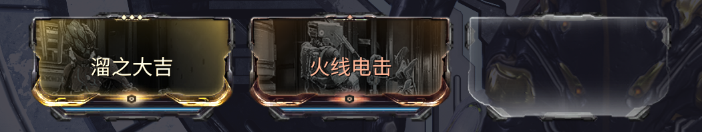

---
metaLinks:
  alternates:
    - >-
      https://app.gitbook.com/s/sc7MPTyiIfSwOeLlvpUg/builds/advanced-builds/parazon
---

# 灭骸之刃


[**溜之大吉**](https://warframe.huijiwiki.com/wiki/%E6%BA%9C%E4%B9%8B%E5%A4%A7%E5%90%89) **是必备的** mod，它可以帮助你在首充后快速的到达兆力使的位置。

[**火线电击**](https://warframe.huijiwiki.com/wiki/%E7%81%AB%E7%BA%BF%E7%94%B5%E5%87%BB) 很好用，它可以在破解时让周围的敌人失去行动能力。



在 Nova 多人中<mark style="color:$danger;">**避免携带**</mark>[**无迹可寻**](https://warframe.huijiwiki.com/wiki/%E6%97%A0%E8%BF%B9%E5%8F%AF%E5%AF%BB)。如果单人想要装备此 mod，最好在无障碍里将隐身视觉效果改成“<mark style="color:$warning;">**半透明斗篷**</mark>”或者“<mark style="color:$warning;">**发光斗篷**</mark>”。

