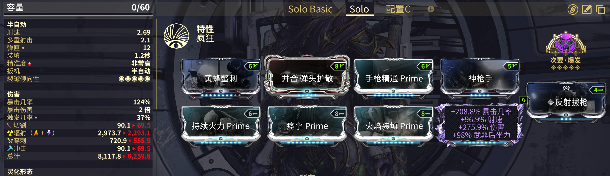
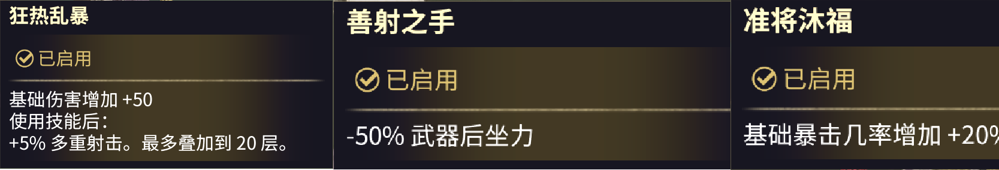
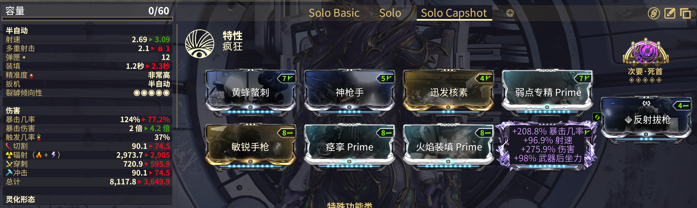
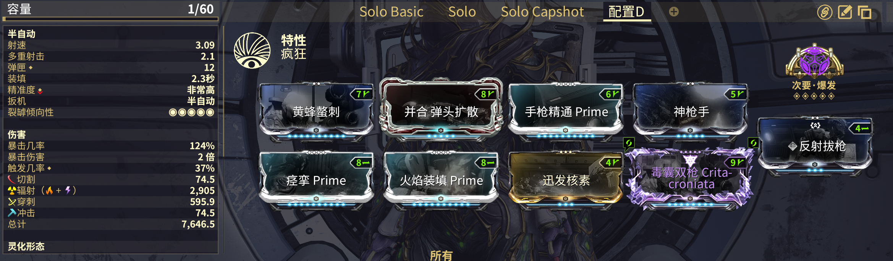

---
metaLinks:
  alternates:
    - >-
      https://app.gitbook.com/s/sc7MPTyiIfSwOeLlvpUg/builds/advanced-builds/secondary
---

# 次要武器

## 灵化毒囊双枪

#### **次要爆发配装**


目前次要爆发配装几乎没用了，因为我们可以[直接使用增幅器击破关节](../../basics/how-to-break-shield-+-limb.md)，尽管它对于某些特定情况下还有用。


#### 本体配装


确保携带[**敏锐手枪**](https://warframe.huijiwiki.com/wiki/%E6%95%8F%E9%94%90%E6%89%8B%E6%9E%AA)以大幅增加爆头伤害。



也可以将你的第二个灵化词条改成第一个选项：屠杀统治


## 灵化暗杀者


使用和灵化毒囊双枪相同的配卡，和[<mark style="color:$success;">**紫卡指南**</mark>](../riven-guide.md)中推荐的紫卡。

