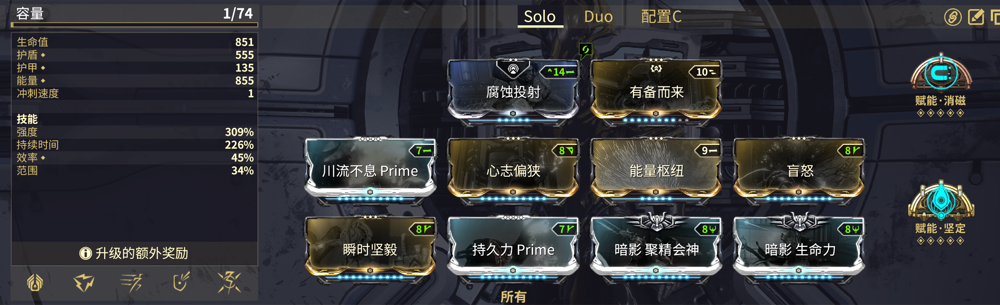
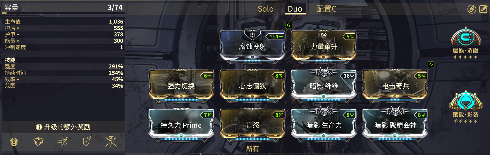

---
metaLinks:
  alternates:
    - https://app.gitbook.com/s/sc7MPTyiIfSwOeLlvpUg/builds/advanced-builds/volt
---

# Volt

## 单人


**暗影生命力**、**能量枢纽**和**坚定赋能**是可替换的


## 双人


盲怒可以替换为瞬时坚毅。为了让电盾的持续时间满足出水需求，心志偏狭和持久力 Prime 是必须的。

[**影袭赋能**](https://warframe.huijiwiki.com/wiki/%E5%BD%B1%E8%A2%AD%E8%B5%8B%E8%83%BD)可以和刺影的2技能联动。或者可以装备[**坦克赋能**](https://warframe.huijiwiki.com/wiki/%E5%9D%A6%E5%85%8B%E8%B5%8B%E8%83%BD)+[**主要堡垒**](https://warframe.huijiwiki.com/wiki/%E4%B8%BB%E8%A6%81%E5%A0%A1%E5%9E%92)（在天穹之顶上）。



源力石

3-4 紫晶源力石：主要武器电击伤害

1-2 琥珀源力石：施放速度


