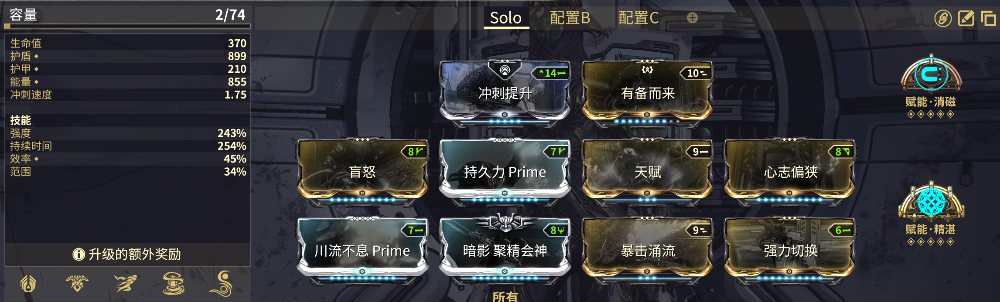

---
metaLinks:
  alternates:
    - https://app.gitbook.com/s/sc7MPTyiIfSwOeLlvpUg/builds/advanced-builds/wisp
---

# Wisp


**强力切换**和**精湛赋能**是可替换槽位。


<figure><figcaption></figcaption></figure>


5x 琥珀执刑官 Tau 融造源力石。非常重要，加快 3 技能传送的动作。

