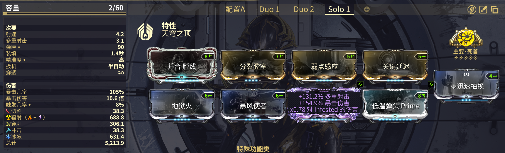
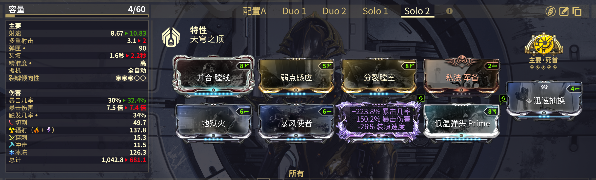
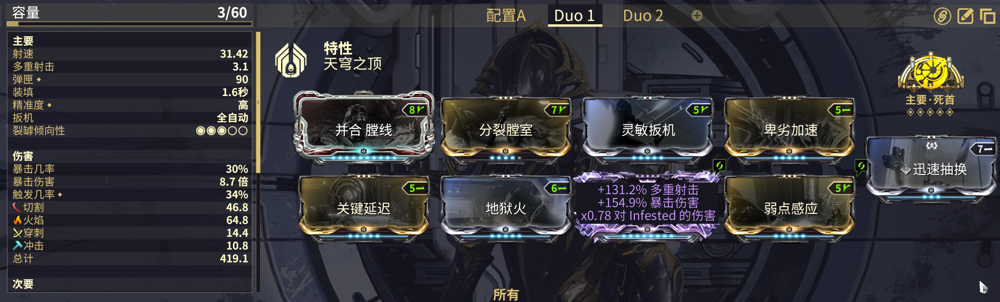
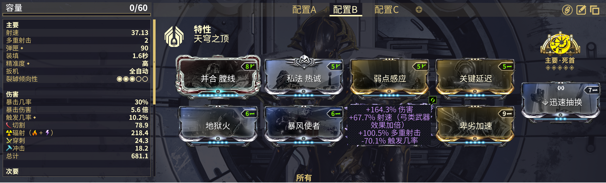

---
metaLinks:
  alternates:
    - >-
      https://app.gitbook.com/s/sc7MPTyiIfSwOeLlvpUg/builds/advanced-builds/zenith
---

# 天穹之顶

## 单人 3.2 射速 3 多重

## 单人 3.2 射速 2 多重

## 多重 8.7 射速 3 多重

<figure><figcaption>
在战甲上装备紫晶源力石增加主武器电击伤害复合元素为辐射
</figcaption></figure>

## 多人 10 射速 2 多重


对于上面的所有配置：如果使用[**坦克赋能**](https://warframe.huijiwiki.com/wiki/%E5%9D%A6%E5%85%8B%E8%B5%8B%E8%83%BD)则[**主要堡垒**](https://warframe.huijiwiki.com/wiki/%E4%B8%BB%E8%A6%81%E5%A0%A1%E5%9E%92)也是一个可选项。

