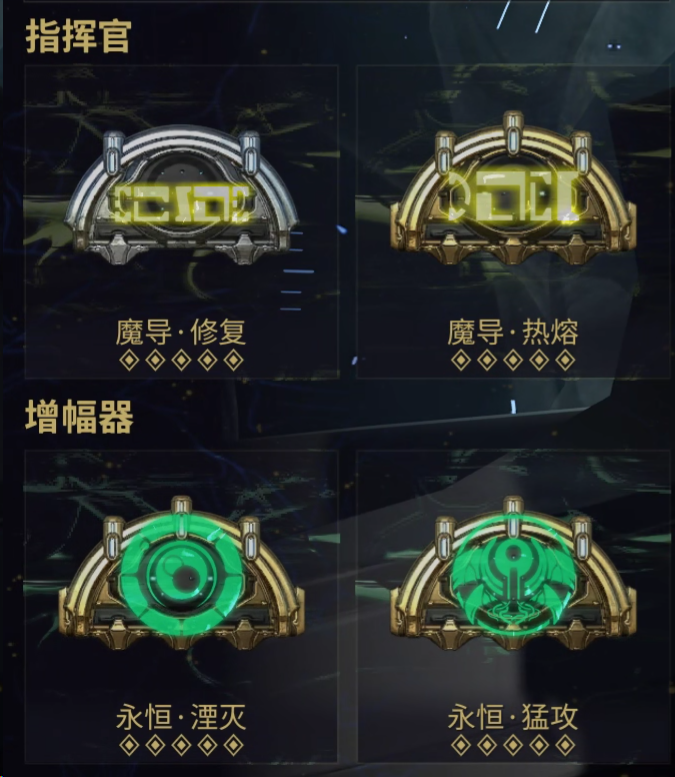

---
metaLinks:
  alternates:
    - >-
      https://app.gitbook.com/s/sc7MPTyiIfSwOeLlvpUg/builds/amp-and-operator-arcanes
---

# 增幅器 & 指挥官赋能

## 增幅器 赋能

1. [**永恒湮灭**](https://warframe.huijiwiki.com/wiki/%E6%B0%B8%E6%81%92%E6%B9%AE%E7%81%AD) 使用指挥官技能时： +60% 增幅器伤害，持续 8 秒
2. [**永恒猛攻**](https://warframe.huijiwiki.com/wiki/%E6%B0%B8%E6%81%92%E7%8C%9B%E6%94%BB) 指挥官能量耗尽时：+180% 增幅器暴击几率，持续 8 秒

## 指挥官赋能

1. [**魔导修复**](https://warframe.huijiwiki.com/wiki/%E9%AD%94%E5%AF%BC%E4%BF%AE%E5%A4%8D)或者[**魔导振奋**](https://warframe.huijiwiki.com/wiki/%E9%AD%94%E5%AF%BC%E6%8C%AF%E5%A5%8B)，用来治疗战甲
2. [**魔导热熔**](https://warframe.huijiwiki.com/wiki/%E9%AD%94%E5%AF%BC%E7%83%AD%E7%86%94) 为增幅器增加 210% 火焰伤害，帮助你使用增幅器击破关节。

<figure><figcaption></figcaption></figure>
