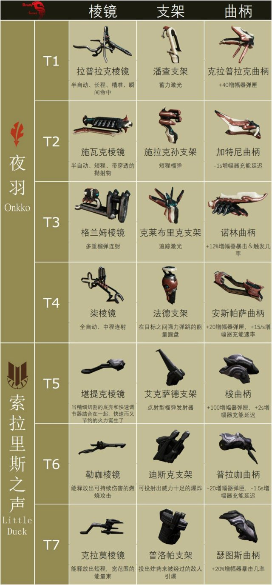

---
metaLinks:
  alternates:
    - https://app.gitbook.com/s/sc7MPTyiIfSwOeLlvpUg/builds/amp-builds-modules
---

# 增幅器组装

增幅器是指挥官武器，用来打破夜灵护盾。


为了解锁增幅器，你需要先完成主线[**内战**](https://warframe.huijiwiki.com/wiki/%E5%86%85%E6%88%98)和[**萨娅的守夜**](https://warframe.huijiwiki.com/wiki/%E8%90%A8%E5%A8%85%E7%9A%84%E5%AE%88%E5%A4%9C)。

要解锁进阶的增幅器部件，你需要完成[**索拉利斯之声**](https://warframe.huijiwiki.com/wiki/%E7%B4%A2%E6%8B%89%E9%87%8C%E6%96%AF%E4%B9%8B%E5%A3%B0%EF%BC%88%E7%B3%BB%E5%88%97%E4%BB%BB%E5%8A%A1%EF%BC%89)任务并达到金星声望的等级 5。


### **拉普拉克棱镜 – 施拉克孙支架 – 诺林曲柄 (1-2-3)**

* 如果你还没有解锁福尔图娜，那么这就是最好的增幅器。
* 所有部件都可以在夜羽昂克那里购买。

### **拉普拉克棱镜 – 施拉克孙支架 – 瑟图斯曲柄 (1-2-7)**

* 单人狩猎毫无疑问的最佳增幅器。

### **拉普拉克棱镜 – 普洛帕支架 – 瑟图斯曲柄 (1-7-7)**

* 在 Nova 双人中仍然是最佳选择。
* 客机的唯一选择。
* 无论单人还是多人，作为入门增幅器都很不错。

<mark style="color:$info;">**克拉莫棱镜 – 普洛帕支架 – 瑟图斯曲柄 (7-7-7)**</mark>

* <mark style="color:$info;">非常无脑的选择。</mark>
* <mark style="color:$info;">仅限那些不想深入学习的新手。</mark>
