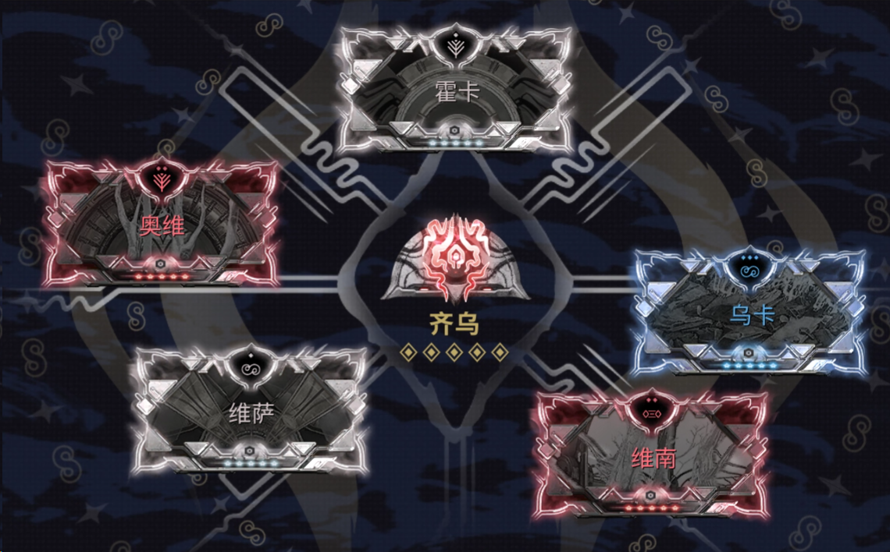

---
metaLinks:
  alternates:
    - https://app.gitbook.com/s/sc7MPTyiIfSwOeLlvpUg/builds/amp-mods-thara
---

# 增幅器 MOD - 狂勇

<strong>旧日和平 - 快速开始</strong>

1. 完成**旧日和平系列任务**
2. 前往游戏内的商城购买**工匠使文物获取组合包**（175P）
3. 切换到**漂泊者**，并前往火卫二的解剖圣所
4. 按下“Q”键快速移动到[**大教堂**](https://warframe.huijiwiki.com/wiki/%E5%A4%A7%E6%95%99%E5%A0%82)
5. 和玛丽对话，然后从她那里购买[**狂勇**](https://warframe.huijiwiki.com/wiki/%E5%B7%A5%E5%8C%A0%E4%BD%BF%E6%96%87%E7%89%A9#Madurai%E5%AD%A6%E6%B4%BE-0)（弓），这是 Madurai 专精武器，**不要购买其他的**

现在你可以在**狂勇**上装备 mod，装备正确的 mod 可以提升增幅器的伤害。

<strong>如何获取这些 mod</strong>

* [**从 wm 交易**](https://warframe.market/items/hok_kaal?type=sell) 或者
* 在你完成序列任务[**旧日和平**](https://warframe.huijiwiki.com/wiki/%E6%97%A7%E6%97%A5%E5%92%8C%E5%B9%B3)之后，你会在星图导航那里看到[**深溯池**](https://warframe.huijiwiki.com/wiki/%E6%B7%B1%E6%BA%AF%E6%B1%A0)选项，其中[**佩利塔叛乱**](https://warframe.huijiwiki.com/wiki/%E4%BD%A9%E9%87%8C%E5%A1%94%E5%8F%9B%E4%B9%B1)的每个人物都会掉落这些 mod，大概 2 小时左右你就能获取到所有需要的 mod。

<figure><figcaption></figcaption></figure>

### **必备 MOD**

<strong>霍卡</strong>

* 在进入虚空模式后，增幅器的下一次攻击会获得 **x3.0 额外伤害**（冷却时间 5 秒）
* 增幅器的次要射击也会消耗加成。

<strong>奥维</strong>

* **+60% 增幅器暴击几率** 和 +10% 增幅器暴击伤害（每装备一张 Zenurik 学派的 mod）
* 这个 mod 允许客机的 7 支架达到 100% 暴击几率（[**7 支架客机 bug**](https://forums.warframe.com/topic/1454706-amp-bug-for-clients/)）

<strong>乌卡</strong>

* **+60% 增幅器伤害**，每个不同学派的 mod 额外 +10%

<strong>维萨</strong>

* **+30% 增幅器射速** +30% 增幅器弹药效率
* 在你的 1 棱镜 / 7 支架 失误的时候非常有用。
* 这个 mod 不是必须的

<strong>任何 Zenurik 学派 mod</strong>

* 装备一张任意 Zenurik 学派 mod，获得 **奥维 +10% 暴击伤害** 奖励
* [**埃伊**](https://warframe.huijiwiki.com/wiki/%E5%9F%83%E4%BC%8A) 虚空冲刺距离和范围

### **避免装备的 MOD**

哈达 <mark style="color:$danger;"><strong>(绝对不要装备)</strong></mark>

* <mark style="color:$info;">+60% 增幅器多重射击</mark>
* 多重射击很糟糕，因为它通常是多余的，而且更重要的是，它会导致**伤害衰减**，所以会使伤害变低。

<mark style="color:$info;"><strong>塔安</strong></mark>

* <mark style="color:$info;">获得击倒免疫。当击倒被格挡时，进入虚空模式 3 秒（冷却时间 7.5 秒）</mark>
* 获得击倒免疫，但可惜的是，这个 mod 现在存在一些 bug，有时候你仍然会被击倒。

