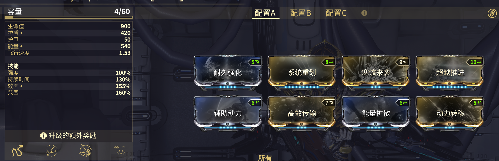

---
metaLinks:
  alternates:
    - >-
      https://app.gitbook.com/s/sc7MPTyiIfSwOeLlvpUg/builds/beginner-builds/archwing
---

# 曲翼

## 刺影

刺影是夜灵狩猎中最好的曲翼。

你只需要两个关键 mod ，但推荐额外装备一些生存能力、范围和技能效率的 mod。


不要增加技能强度，避免杀死小夜灵。


**关键 Mods**

* [**寒流来袭**](https://warframe.huijiwiki.com/wiki/%E5%AF%92%E6%B5%81%E6%9D%A5%E8%A2%AD)**:** 使你的 3 技能（星体震荡）可以冻结敌人，对于处理小夜灵非常有帮助。
* [**超越推进**](https://warframe.huijiwiki.com/wiki/%E8%B6%85%E8%B6%8A%E6%8E%A8%E8%BF%9B)**:** 进一步提升你的冲刺速度。随着狩猎效率的提高，冲刺速度会变得越来越重要。

