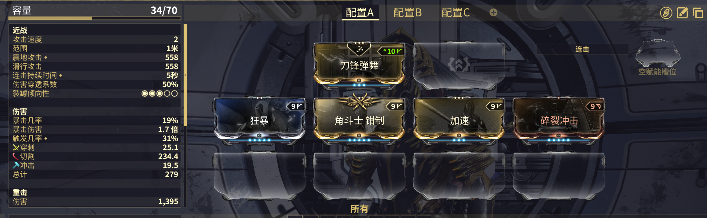

---
metaLinks:
  alternates:
    - >-
      https://app.gitbook.com/s/sc7MPTyiIfSwOeLlvpUg/builds/beginner-builds/melee-weapon
---

# 近战武器

## 瓦斯提枪刃 或者 蛇刃


* [**瓦斯提枪刃**](https://warframe.huijiwiki.com/wiki/%E7%93%A6%E6%96%AF%E6%8F%90%E6%9E%AA%E5%88%83)可以用[**蛇刃**](https://warframe.huijiwiki.com/wiki/%E8%9B%87%E5%88%83)替代，但瓦斯提枪刃更好用。
* [**碎裂冲击**](https://warframe.huijiwiki.com/wiki/%E7%A2%8E%E8%A3%82%E5%86%B2%E5%87%BB)只需要几下射击就可以清除夜灵的护甲。
* 如果你的次要武器上装备了[**次要爆发**](https://warframe.huijiwiki.com/wiki/%E6%AC%A1%E8%A6%81%E7%88%86%E5%8F%91)，确保你的配卡中包含一些额外连击几率。
* 你可以从 [**wf.market**](https://warframe.market/items/vastilok?type=sell) 上购买瓦斯提枪刃。

