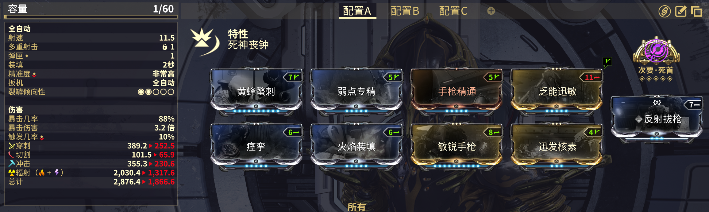
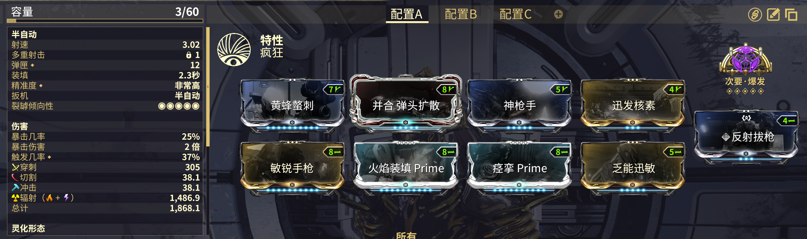

# 次要武器

## 丧钟 Prime


**丧钟 Prime** 可以从 [**WF.market**](https://warframe.market/items/knell_prime_set?type=sell) 上购买

[**敏锐手枪**](https://warframe.huijiwiki.com/wiki/%E6%95%8F%E9%94%90%E6%89%8B%E6%9E%AA) mod 非常重要，可以从 [**Wf.market**](https://warframe.market/items/pistol_acuity?type=sell) 上购买



**一直射击直到重新装填，然后再通过大门返回希图斯：**


<mark style="color:orange;"><strong>丧钟</strong></mark>




如果在离开平原之前不这么做，丧钟会在接下来的轮次当中无法使用


## 灵化毒囊双枪

<figure><figcaption></figcaption></figure>


必须装备 [**毒囊双枪灵化之源**](https://warframe.huijiwiki.com/wiki/%E6%AF%92%E5%9B%8A%E5%8F%8C%E6%9E%AA%E7%81%B5%E5%8C%96%E4%B9%8B%E6%BA%90)

这个武器比丧钟更好，但是他需要**灵化之源**，这可能需要等待数周才可以[**获取**](https://warframe.huijiwiki.com/wiki/%E6%97%A0%E5%B0%BD%E5%9B%9E%E5%BB%8A#%E9%92%A2%E9%93%81%E4%B9%8B%E8%B7%AF%E6%97%A0%E5%B0%BD%E5%9B%9E%E5%BB%8A)。


<figure><figcaption></figcaption></figure>
