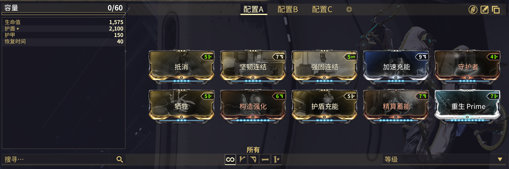

# 守护


[**守护**](https://warframe.huijiwiki.com/wiki/%E5%AE%88%E6%8A%A4)比其他类型的同伴更合适。

“野兽”或者“机器型野兽”同伴，通常只会碍事。


## 蛟龙 Prime

<figure><figcaption></figcaption></figure>

**关键 Mods:**

* [**抵消**](https://warframe.huijiwiki.com/wiki/%E6%8A%B5%E6%B6%88)**：**&#x86DF;龙 Prime 的专属 mod, 每 5 秒可以清除一次异常状态。不是必须，但非常好用。 [WF.market](https://warframe.market/items/negate?type=sell)
* [**守护者**](https://warframe.huijiwiki.com/wiki/%E5%AE%88%E6%8A%A4%E8%80%85)**：**&#x5FC5;备品。当护盾归零时，立即完全恢复，提供稳定的护盾保险。&#x20;
* [**强固连结**](https://warframe.huijiwiki.com/wiki/%E5%BC%BA%E5%9B%BA%E8%BF%9E%E7%BB%93)**：**&#x5982;果守护的护盾超过 1200 时 **+60% 射速** （只需要装备满级精算蓄能）。
* [**坚韧连结**](https://warframe.huijiwiki.com/wiki/%E5%9D%9A%E9%9F%A7%E8%BF%9E%E7%BB%93)**:** 为所有武器 **+120% 暴击伤害**（守护武器的暴击几率需要超过 50% ，使用金工火枪并装备致命一击）。一种被动提升 DPS 的好方式。

**生存能力**

尽管蛟龙本身生存能力出色，还是建议装备一些生存 mod：

* 构造强化
* 精算蓄能
* 重生 Prime

蛟龙存活的越久，提供的帮助就越大。
