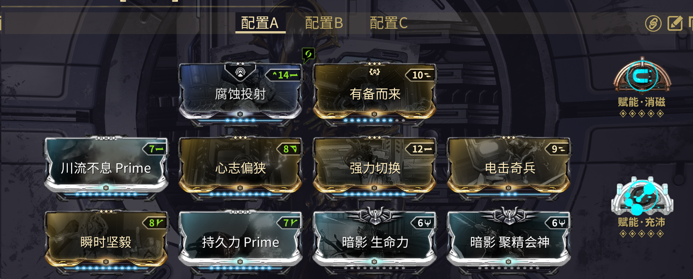

---
metaLinks:
  alternates:
    - https://app.gitbook.com/s/sc7MPTyiIfSwOeLlvpUg/builds/beginner-builds/volt
---

# Volt

<figure><figcaption>
普通版本和Prime版本都可以使用
</figcaption></figure>

Volt 是夜灵狩猎中的顶级战甲之一。除了4技能外，他的所有技能都很有用，而该技能通常被替换为 Mirage 的黯然失色，以换取可观的武器增伤。

1. [**电击**](https://warframe.huijiwiki.com/wiki/%E7%94%B5%E5%87%BB) **(电击奇兵)**\
   电击奇兵会为武器附带电击伤害加成，增加输出
2. [**加速**](https://warframe.huijiwiki.com/wiki/%E5%8A%A0%E9%80%9F)\
   加速会提升你的移动速度，在曲翼模式下同样生效。此技能对于快速穿越开放地图非常有用
3. [**电力屏障**](https://warframe.huijiwiki.com/wiki/%E7%94%B5%E5%8A%9B%E5%B1%8F%E9%9A%9C)\
   任何穿过电力屏障的射击（包括增幅器）都会获得附加伤害和额外的暴击伤害。这个技能也是 Volt 在夜灵狩猎中的核心技能。
4.  [**黯然失色**](https://warframe.huijiwiki.com/wiki/%E9%BB%AF%E7%84%B6%E5%A4%B1%E8%89%B2) **(**[**移植**](https://warframe.huijiwiki.com/wiki/Helminth)**)**\
    使用黯然失色替换电能释放，它会提供客观的伤害加成或者可选的伤害减免 Buff（二者不能同时使用）

    

理想情况下使用 Volt Prime，他拥有更高的基础能量和冲刺速度。

[**暗影 Mods**](https://warframe.huijiwiki.com/wiki/Umbra%E7%B3%BB%E5%88%97MOD)

* 获得可观的 Sentient 伤害减免，不需要将它们升到满级。

[**赋能消磁**](https://warframe.huijiwiki.com/wiki/%E6%B6%88%E7%A3%81%E8%B5%8B%E8%83%BD)

* 避免触发[**磁力异常**](https://warframe.huijiwiki.com/wiki/%E4%BC%A4%E5%AE%B3_2.0/%E7%A3%81%E5%8A%9B%E4%BC%A4%E5%AE%B3)

[**执刑官源力石**](https://warframe.huijiwiki.com/wiki/%E6%89%A7%E5%88%91%E5%AE%98%E6%BA%90%E5%8A%9B%E7%9F%B3)

* 不需要装备执刑官源力石，你也可以轻松的完成狩猎。如果你有多的源力石，可以尝试安装一到两个琥珀源力石提升施放速度。
