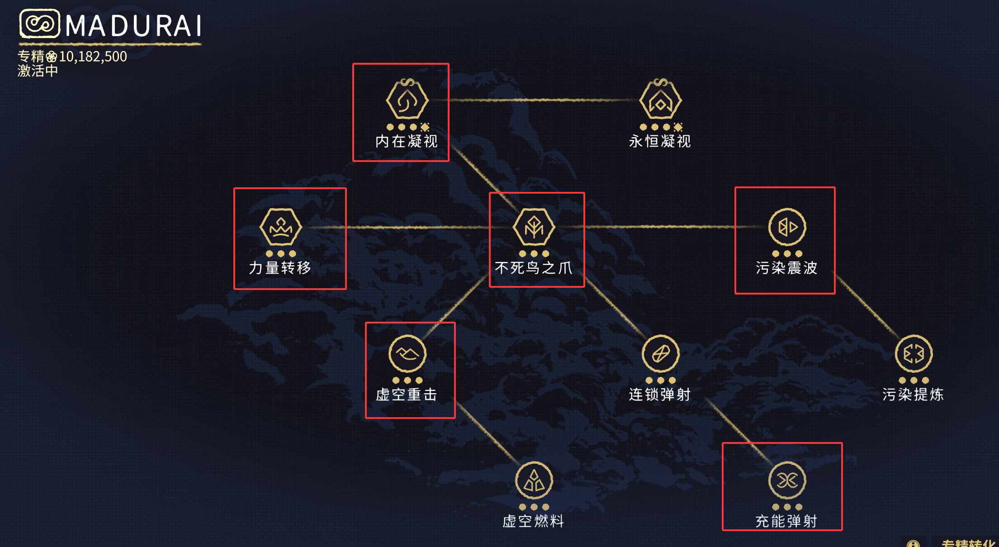
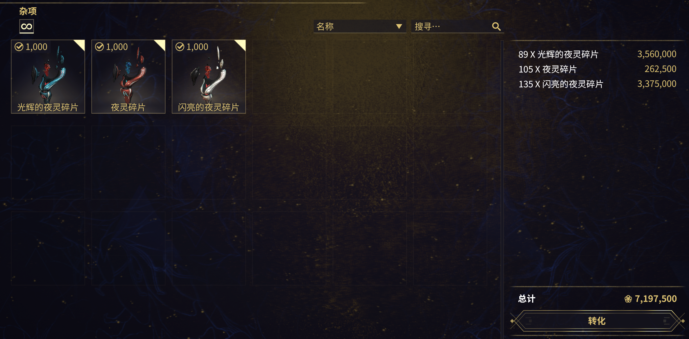
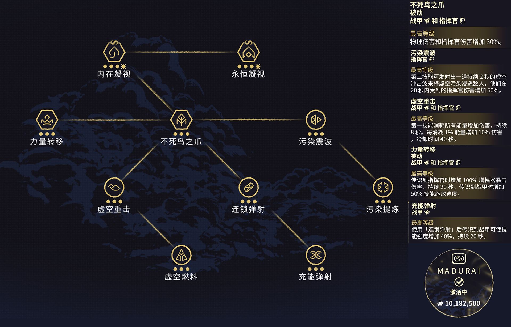

---
metaLinks:
  alternates:
    - https://app.gitbook.com/s/sc7MPTyiIfSwOeLlvpUg/builds/focus-school
---

# 专精学派

在夜灵狩猎中，[**Madurai**](https://warframe.huijiwiki.com/wiki/%E4%B8%93%E7%B2%BE_2.0#Madurai-1) 是首选的专精学派。下面的截图中，高亮部分是你需要完全解锁的主要技能，你可以优先解锁这些，其他的等以后再说。你可以通过[**将夜灵碎片兑换为专精点数**](https://warframe.huijiwiki.com/wiki/%E4%B8%93%E7%B2%BE_2.0#%E4%B8%93%E7%B2%BE%E8%BD%AC%E5%8C%96)来快速的解锁专精。

